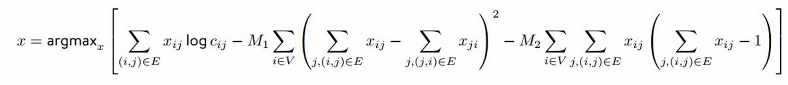

## Presentation

Presented on 2021/6/29. Slides are available [here](https://docs.google.com/presentation/d/1Y7Ps9WcomCCpFojgtLt-LdptRU9dq9axmlOFJ6MbmJU).

## QUBO2Ising explanation

If the reader does not render LaTeX, please refer to README.pdf.

#### QUBO formulation of currency exchange problem

is equivalent to
$$
\DeclareMathOperator*{\argmin}{argmin}
\begin{align}
    x & = \argmin_x \left\{
        \sum_{i=0}^{n-1} \sum_{j=0}^{n-1} (-log_2(c_{ij})) x_{ij}
      	+ M_1 \sum_{i=0}^{n-1}
        	\left( \sum_{j=0}^{n-1} x_{ij} - \sum_{j=0}^{n-1} x_{ji} \right)^2
      	+ M_2 \sum_{i=0}^{n-1}
      		\left( \sum_{j=0}^{n-1} x_{ij} \right)
      		\left( \sum_{j=0}^{n-1} x_{ij} -1 \right)
    \right\}
    
	\\
	& \text{Expand the 1st term:}
    \\
    & \sum_{i=0}^{n-1} \sum_{j=0}^{n-1} (-log_2(c_{ij})) x_{ij}
    \\
    & = \sum_{i=0}^{n-1} \sum_{j=0}^{n-1} (-log_2(c_{ij})) x_{ij} x_{ij}
    
	\\
	& \text{Expand the 2nd term:}
	\\
    & M_1 \sum_{i=0}^{n-1}
    	\left( \sum_{j=0}^{n-1} x_{ij} - \sum_{j=0}^{n-1} x_{ji} \right)^2
    \\
    & = M_1 \sum_{i=0}^{n-1}
	    \left( \sum_{j=0}^{n-1} (x_{ij} - x_{ji}) \right)^2
    \\
    & = M_1 \sum_{i=0}^{n-1}
	    \left( \sum_{j=0}^{n-1} (x_{ij} - x_{ji}) \right)
	    \left( \sum_{k=0}^{n-1} (x_{ik} - x_{ki}) \right)
    \\
    & = M_1 \sum_{i=0}^{n-1} \sum_{j=0}^{n-1} \sum_{k=0}^{n-1}
		(x_{ij} - x_{ji}) (x_{ik} - x_{ki})
    \\
    & = M_1 \sum_{i=0}^{n-1} \sum_{j=0}^{n-1} \sum_{k=0}^{n-1}
		(x_{ij}x_{ik} - x_{ij}x_{ki} - x_{ji}x_{ik} + x_{ji}x_{ki})
	
	\\
	& \text{Expand the 3rd term:}
	\\
    & M_2 \sum_{i=0}^{n-1}
        \left( \sum_{j=0}^{n-1} x_{ij} \right)
        \left( \sum_{j=0}^{n-1} x_{ij} -1 \right)
    \\
    & = M_2 \sum_{i=0}^{n-1}
        \left( \sum_{j=0}^{n-1} x_{ij} \right)
        \left( \sum_{k=0}^{n-1} x_{ik} -1 \right)
    \\
    & = M_2 \sum_{i=0}^{n-1} \left(
            \sum_{j=0}^{n-1} \sum_{k=0}^{n-1} x_{ij} x_{ik}
            -
            \sum_{j=0}^{n-1} x_{ij}
        \right)
    \\
    & = M_2 \sum_{i=0}^{n-1} \left(
            \sum_{j=0}^{n-1} \sum_{k=0}^{n-1} x_{ij} x_{ik}
            -
            \sum_{j=0}^{n-1} x_{ij} x_{ij}
        \right)
    \\
    
    & \text{Change subscripts:}
    \\
    & x_{ab} \to x_{a\times n + b}
\end{align}
$$

#### Another formulation in "A Currency Arbitrage Machine based on the Simulated Bifurcation Algorithm for Ultrafast Detection of Optimal Opportunity," 2020

$$
\DeclareMathOperator*{\argmin}{argmin}
\begin{align}
	x & = \argmin_x \left\{
        m_c \sum_{i=0}^{n-1} \sum_{j=0}^{n-1} (-log_2(c_{ij})) x_{ij}
      	+ \sum_{i=0}^{n-1}
        	\left( \sum_{j=0}^{n-1} x_{ij} - \sum_{j=0}^{n-1} x_{ji} \right)^2
      	+ \sum_{i=0}^{n-1}
      		\sum_{j \neq j'} \left( x_{ij} x_{ij'} + x_{ji} x_{j'i}\right)
      	+ \sum_{i=0}^{n-1}
      		\sum_{j=0}^{n-1} x_{ij} x_{ji}
    \right\}
    
	\\
	& \text{Expand the 1st term:}
    \\
    & \sum_{i=0}^{n-1} \sum_{j=0}^{n-1} (-log_2(c_{ij})) x_{ij}
    \\
    & = \sum_{i=0}^{n-1} \sum_{j=0}^{n-1} (-log_2(c_{ij})) x_{ij} x_{ij}
    
    \\
	& \text{Expand the 2nd term:}
	\\
    & \sum_{i=0}^{n-1}
    	\left( \sum_{j=0}^{n-1} x_{ij} - \sum_{j=0}^{n-1} x_{ji} \right)^2
    \\
    & = \sum_{i=0}^{n-1}
	    \left( \sum_{j=0}^{n-1} (x_{ij} - x_{ji}) \right)^2
    \\
    & = \sum_{i=0}^{n-1}
	    \left( \sum_{j=0}^{n-1} (x_{ij} - x_{ji}) \right)
	    \left( \sum_{k=0}^{n-1} (x_{ik} - x_{ki}) \right)
    \\
    & = \sum_{i=0}^{n-1} \sum_{j=0}^{n-1} \sum_{k=0}^{n-1}
		(x_{ij} - x_{ji}) (x_{ik} - x_{ki})
    \\
    & = \sum_{i=0}^{n-1} \sum_{j=0}^{n-1} \sum_{k=0}^{n-1}
		(x_{ij}x_{ik} - x_{ij}x_{ki} - x_{ji}x_{ik} + x_{ji}x_{ki})
    
    \\
	& \text{Expand the 3rd term:}
	\\
    & \sum_{i=0}^{n-1}
    	\sum_{j \neq j'} \left( x_{ij} x_{ij'} + x_{ji} x_{j'i}\right)
    \\
    & = \frac{1}{2} \sum_{i=0}^{n-1} \left(
	     \sum_{j=0}^{n-1} \sum_{k=0}^{n-1}
	    	\left( x_{ij} x_{ik} + x_{ji} x_{ki}\right)
	    - \sum_{j=0}^{n-1}
	    	\left( x_{ij} x_{ij} + x_{ji} x_{ji}\right)
    \right)
    
    \\
	& \text{Expand the 4th term: already in expanded form}
	\\
    & \sum_{i=0}^{n-1}
    	\sum_{j=0}^{n-1} x_{ij} x_{ji}
    
    \\
    & \text{Change subscripts:}
    \\
    & x_{ab} \to x_{a\times n + b}
\end{align}
$$

#### QUBO

$$
\DeclareMathOperator*{\argmin}{argmin}
Q \in \mathbb{R}^{N\times N}, Q = Q^T, x_i \in \{0, 1\}
\\
f_Q(Q, x) = \sum_{i=0}^{N-1} \sum_{j=0}^{N-1} Q_{ij} x_i x_j
\\
x_{opt} = \argmin_x f_Q(Q, x)
$$

#### Ising model

$$
\DeclareMathOperator*{\argmin}{argmin}
J \in \mathbb{R}^{N\times N}, J=J^T, h \in \mathbb{R}^{N}, s_i \in \{-1, 1\}
\\
H(J, h, s) = - \frac{1}{2} \sum_{i=0}^{N-1} \sum_{j=0}^{N-1} J_{ij} s_i s_j + \sum_{i=0}^{N-1} {h_i s_i}
\\
s_{opt} = \argmin_s H(J, h, s)
$$

#### Convert QUBO to Ising model

$$
\begin{align}

& \text{Let } x_i = \frac{s_i + 1}{2}
\\
& f_Q(Q, x)
\\
& = \sum_{i=0}^{N-1} \sum_{j=0}^{N-1} Q_{ij} x_i x_j
\\
& = \sum_{i=0}^{N-1} \sum_{j=0}^{N-1} Q_{ij} \frac{s_i + 1}{2} \frac{s_j + 1}{2}
\\
& = \sum_{i=0}^{N-1} \sum_{j=0}^{N-1} \frac{Q_{ij}}{4} (s_i s_j + s_i + s_j + 1)
\\
& = \sum_{i=0}^{N-1} \sum_{j=0}^{N-1} \frac{Q_{ij}}{4} s_i s_j
+ \sum_{i=0}^{N-1} \sum_{j=0}^{N-1} \frac{Q_{ij}}{4} s_i
+ \sum_{i=0}^{N-1} \sum_{j=0}^{N-1} \frac{Q_{ij}}{4} s_j
+ \sum_{i=0}^{N-1} \sum_{j=0}^{N-1} \frac{Q_{ij}}{4}
\\
& = -\frac{1}{2}\sum_{i=0}^{N-1} \sum_{j=0}^{N-1} \frac{-Q_{ij}}{2} s_i s_j
+ \sum_{i=0}^{N-1} s_i \left(\sum_{j=0}^{N-1} \frac{Q_{ij}}{4}\right)
+ \sum_{j=0}^{N-1} s_j \left(\sum_{i=0}^{N-1} \frac{Q_{ij}}{4}\right)
+ \sum_{i=0}^{N-1} \sum_{j=0}^{N-1} \frac{Q_{ij}}{4}
\\
& = -\frac{1}{2}\sum_{i=0}^{N-1} \sum_{j=0}^{N-1} \frac{-Q_{ij}}{2} s_i s_j
+ \sum_{i=0}^{N-1} \left(\sum_{j=0}^{N-1} \frac{Q_{ij}}{4} + \sum_{j=0}^{N-1} \frac{Q_{ji}}{4}\right) s_i
+ \sum_{i=0}^{N-1} \sum_{j=0}^{N-1} \frac{Q_{ij}}{4}

\\
& \text{Let } J_{ij} = \frac{-Q_{ij}}{2},
h_i = \left(\sum_{j=0}^{N-1} \frac{Q_{ij}}{4} + \sum_{j=0}^{N-1} \frac{Q_{ji}}{4}\right),
C = \sum_{i=0}^{N-1} \sum_{j=0}^{N-1} \frac{Q_{ij}}{4}
\\
& f_Q(Q, x) = -\frac{1}{2}\sum_{i=0}^{N-1} \sum_{j=0}^{N-1} J_{ij} s_i s_j + \sum_{i=0}^{N-1} h_i s_i + C
= H(J, h, s) + C

\end{align}
$$
